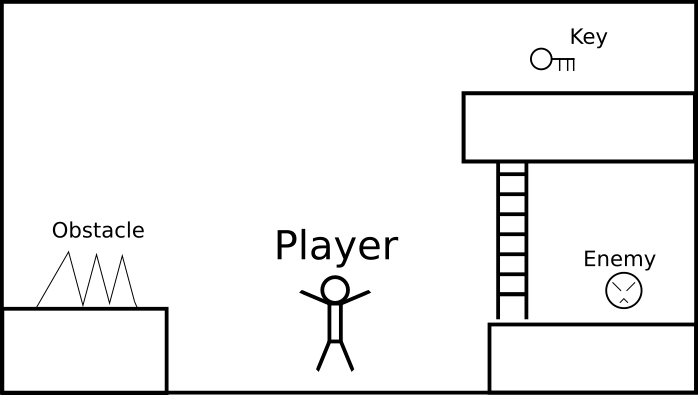
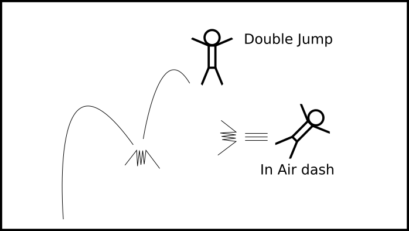

# Table of Contents

1.  [Production point](#org662f100)
2.  [Player Experience](#orgda9dcdb)
3.  [Mechanics](#org8e0e954)
4.  [Game Loop](#org23e944f)
5.  [Theme](#orge516d47)
6.  [Gampley Screen preview](#orged0f797)
    1.  [Abstract](#org63bffc6)
    2.  [Move set preview](#orgc812b2c)

# Production point

Basically very simplistic platformer game. 

# Player Experience

Feeling of adeventure and micro controls

# Mechanics

Player will adventure word by controlling characters with various move sets.

# Game Loop

Player have to achieve specific goals to proceed and learn new move sets which is necessary for further progress. 

# Theme

Fantasy

# Gampley Screen preview

## Abstract

## Move set preview

